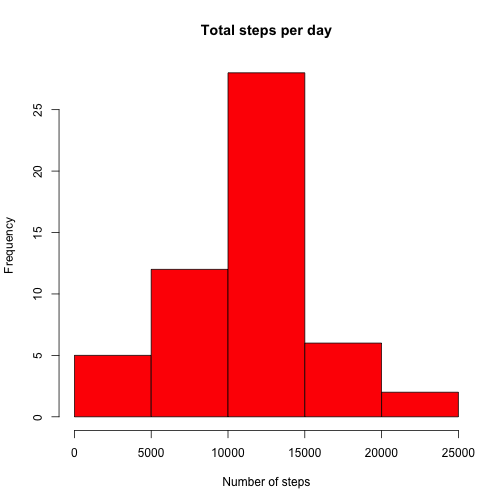
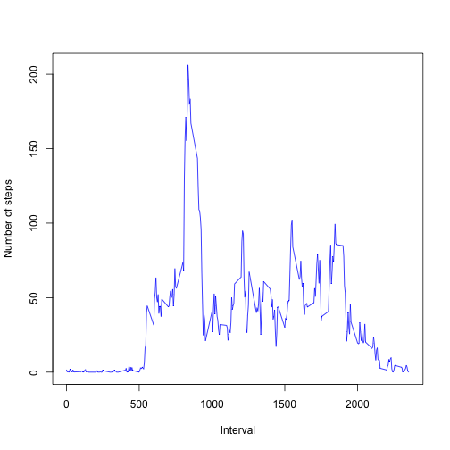
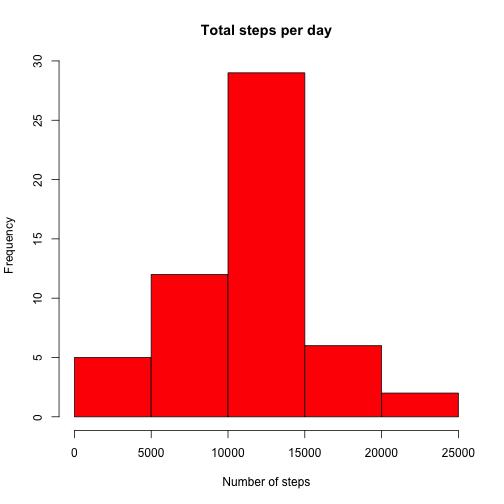
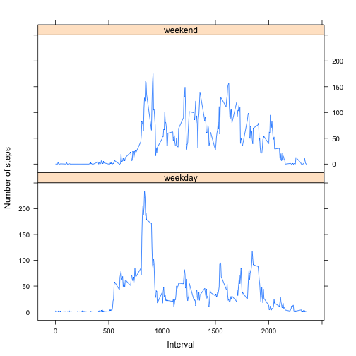

## Loading and preprocessing the data

1. Load the data


```r
# Basic settings
echo = TRUE  # Always make code visible
options(scipen = 1)  # Turn off scientific notations for numbers

# Load
library(lattice)

# Check if the file has already been unzipped
if(!file.exists('activity.csv')){
    unzip('activity.zip')
    }
data <- read.csv('activity.csv')
```

## What is mean total number of steps taken per day?

1. Histogram of the total number of steps taken each day.


```r
stepsPerDay <- aggregate(steps ~ date, data, sum, na.rm=TRUE)
hist(stepsPerDay$steps, col = "red", 
     xlab="Number of steps",
     main="Total steps per day")
```

 

2. Mean and Median


```r
meanStepsPerDay <- mean(stepsPerDay$steps, na.rm = TRUE)
medianStepsPerDay <- median(stepsPerDay$steps, na.rm = TRUE)
```

The mean is 10766.1886792 and the median is 10765.

## What is the average daily activity pattern?

1. Time series plot of the 5-minute interval and the average number of steps taken, averaged across all days.


```r
stepsPerInterval <- aggregate(steps ~ interval, data, mean)
plot(stepsPerInterval$interval, stepsPerInterval$steps, 
     type = "l", col = "blue",
     xlab= "Interval", ylab = "Number of steps")
```

 

2. 5- minute interval with the maximum number of steps


```r
index <- which.max(stepsPerInterval$steps)
maxInterval <- stepsPerInterval[index, 1]
```

The 5-minute interval, that contains the maximum munber of steps averaged across all the days in the dataset is 835

## Imputing missing values

1. Total number of missing values in the dataset (i.e. the total number of rows with NAs).

```r
totalNAs <- sum(!complete.cases(data))
```

The total number of missing values in the dataset is 2304

2. The missing values(NA) of the original data will be replaced with the avarage steps of all days for that 5-minute interval. These values have been calculated above and will be used.


```r
newData <- data
NAs <- is.na(newData$steps)
newData$steps[NAs] <- stepsPerInterval[NAs, 2]
```

3. Histogram of the total number of steps taken each day for the new data.


```r
stepsPerDay2 <- aggregate(steps ~ date, newData, sum, na.rm=TRUE)
hist(stepsPerDay2$steps, col = "red", 
     xlab="Number of steps",
     main="Total steps per day")
```

 

4. Mean and Median for the new data


```r
meanStepsPerDay2 <- mean(stepsPerDay2$steps, na.rm = TRUE)
medianStepsPerDay2 <- median(stepsPerDay2$steps, na.rm = TRUE)
```

The mean for the new data with the replaced NA is 10766.1886792 and the median is 10765.5943396. This shows that the mean has not changed and the median has been changed with a small shift.

## Are there differences in activity patterns between weekdays and weekends?

1. Create a new factor variable in the dataset with two levels – “weekday” and “weekend” indicating whether a given date is a weekday or weekend day.


```r
# Add a factor variable dayType to indicate weekend or weekday
data$dayType <-  factor(ifelse(weekdays(as.Date(data$date)) %in% c("Saturday", "Sunday"), 
                              "weekend",    # if true 
                              "weekday"))  # if false
```

2. Panel plot containing a time series plot (i.e. type = "l") of the 5-minute interval (x-axis) and the average number of steps taken, averaged across all weekday days or weekend days (y-axis). 


```r
stepsPerDay3 <- aggregate(steps ~ interval + dayType, data, mean)
xyplot(steps ~ interval | dayType, stepsPerDay3, type = "l", layout = c(1, 2), 
    xlab = "Interval", ylab = "Number of steps")
```

 


